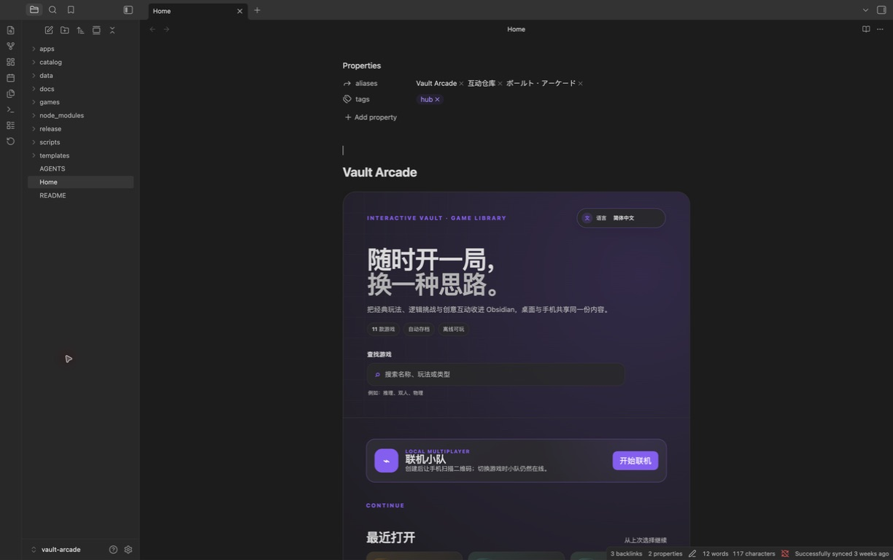
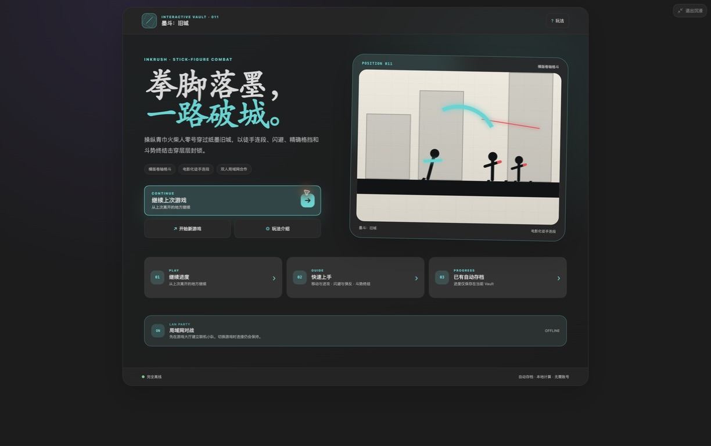
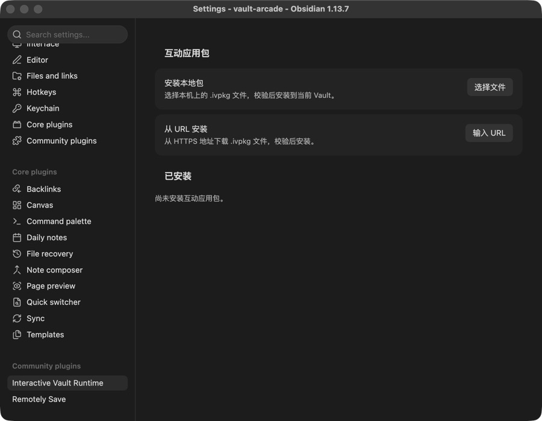

# Vault Arcade Releases

[中文安装手册](docs/INSTALL.zh-CN.md) · [English installation guide](docs/INSTALL.en.md) · [Interactive Vault Runtime](https://github.com/builtbycodeman/interactive-vault-runtime)

Vault Arcade 是一套运行在 Obsidian 中的离线优先游戏合集，包含 11 款适配桌面端和移动端的游戏，支持自动存档、简体中文、English 和日本語。

Vault Arcade is an offline-first collection of 11 games for Obsidian, built for desktop and mobile with autosave and Simplified Chinese, English, and Japanese interfaces.

> 本仓库只用于发布已构建的下载包，不包含游戏源码。安装包通过 GitHub Releases 提供。
>
> This repository only distributes compiled release packages. It does not contain the game source code.

[下载最新版 / Download latest `vault-arcade.ivpkg`](https://github.com/builtbycodeman/vault-arcade-releases/releases/latest/download/vault-arcade.ivpkg)

## Screenshots / 截图

### Game library / 游戏大厅



### Immersive game view / 游戏沉浸模式



### Package installer / 应用包安装入口



## Included games / 收录游戏

- Minesweeper / 扫雷
- Sudoku / 数独
- Linked / 联结
- Tidal Islands / 潮汐群岛
- Gravity Twins / 引力双生
- Battle City / 坦克大战
- Tetris: Crystal Fall / 俄罗斯方块：晶落
- Gomoku / 五子棋
- 2048: Flow / 2048：合流
- Tessera / 缀景
- Inkbreak / 墨斗：旧城

## 中文快速安装

1. 安装并启用 [Interactive Vault Runtime](https://github.com/builtbycodeman/interactive-vault-runtime/releases/latest)。
2. 在 Obsidian 中打开 **设置 → Interactive Vault Runtime → 互动应用包**。
3. 点击**输入 URL**，粘贴下面的固定下载地址：

   ```text
   https://github.com/builtbycodeman/vault-arcade-releases/releases/latest/download/vault-arcade.ivpkg
   ```

4. 确认包信息和安装目录，然后点击**安装**。
5. 安装完成后，从已安装列表打开 Vault Arcade，或打开安装目录中的 `Home` 笔记。

首次安装 Runtime、使用本地 `.ivpkg` 文件、更新和故障排查请参阅[中文安装手册](docs/INSTALL.zh-CN.md)。

## English quick install

1. Install and enable [Interactive Vault Runtime](https://github.com/builtbycodeman/interactive-vault-runtime/releases/latest).
2. In Obsidian, open **Settings → Interactive Vault Runtime → Interactive packages**.
3. Select **Enter URL** and paste the stable download URL below:

   ```text
   https://github.com/builtbycodeman/vault-arcade-releases/releases/latest/download/vault-arcade.ivpkg
   ```

4. Review the package and destination folder, then select **Install**.
5. Open Vault Arcade from the installed package list, or open the `Home` note in its installation folder.

For manual Runtime installation, local `.ivpkg` installation, updates, and troubleshooting, see the [English installation guide](docs/INSTALL.en.md).

## Requirements / 运行要求

- Obsidian 1.6.0 or later / Obsidian 1.6.0 或更高版本
- Interactive Vault Runtime 0.1.12 or later / Interactive Vault Runtime 0.1.12 或更高版本
- Desktop or mobile / 桌面端或移动端

## Security / 安全提示

An `.ivpkg` contains executable JavaScript that runs with Obsidian plugin permissions. Download Vault Arcade only from this repository and verify the SHA-256 checksum published with each release.

`.ivpkg` 包含会以 Obsidian 插件权限运行的 JavaScript。请只从本仓库下载 Vault Arcade，并核对每个 Release 同时提供的 SHA-256 校验值。

