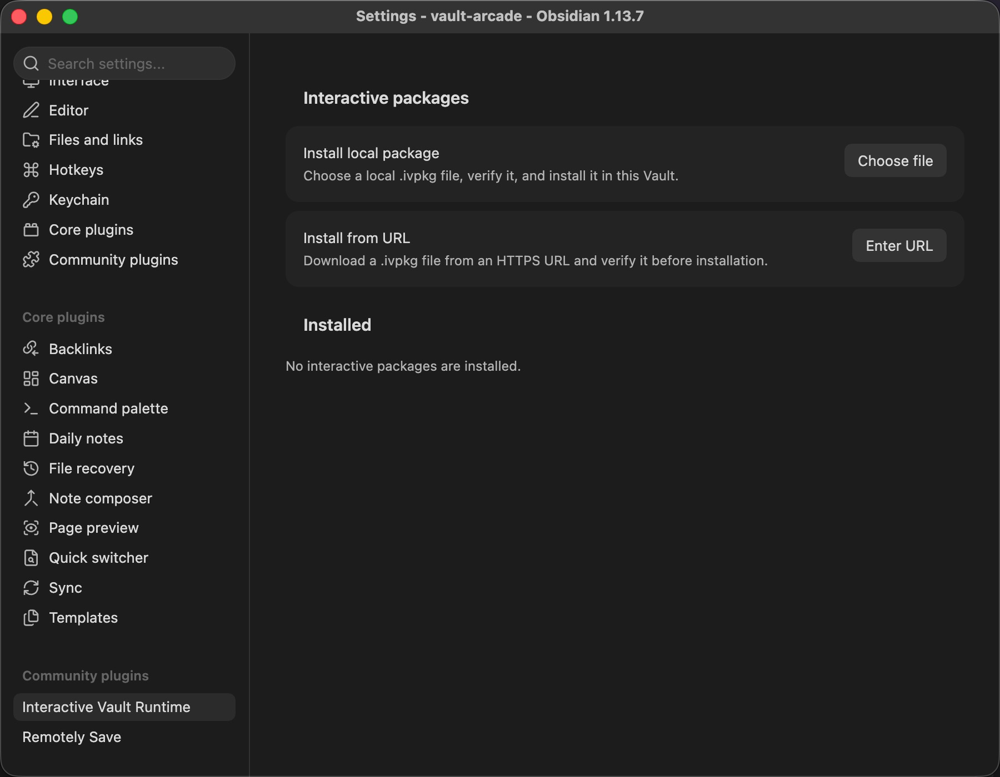
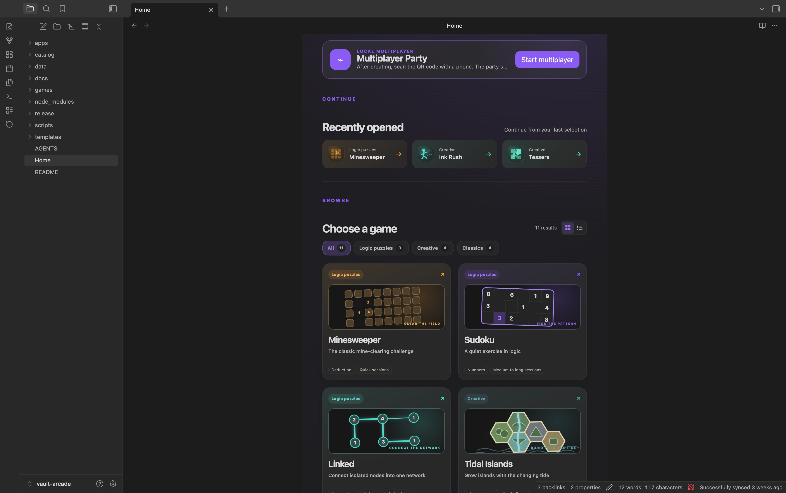
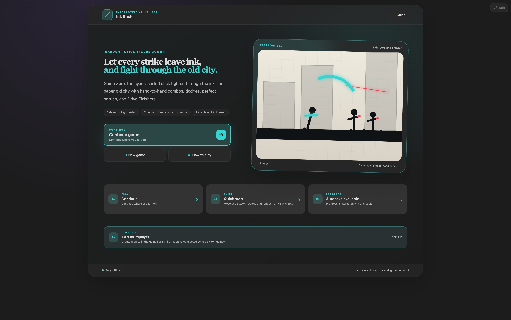

# Vault Arcade installation guide

[Back to README](../README.md) · [中文](INSTALL.zh-CN.md) · [Runtime source repository](https://github.com/builtbycodeman/interactive-vault-runtime)

## Requirements

- Obsidian 1.6.0 or later
- Interactive Vault Runtime 0.1.12 or later
- Obsidian on macOS, Windows, Linux, iOS, or Android

Vault Arcade works offline after installation and does not require an account. LAN multiplayer features require the participating devices to be on the same network.

## Step 1: Install Interactive Vault Runtime

Vault Arcade is not a standalone Obsidian plugin. It is installed and hosted by the open-source Interactive Vault Runtime plugin.

1. Open the [latest Interactive Vault Runtime release](https://github.com/builtbycodeman/interactive-vault-runtime/releases/latest).
2. Download these release assets:

   - `main.js`
   - `manifest.json`
   - `styles.css`

3. Create this plugin directory inside your Vault:

   ```text
   <your-vault>/.obsidian/plugins/interactive-vault-runtime/
   ```

4. Place the three downloaded files directly in that directory.
5. Restart Obsidian or reload the current Vault.
6. Open **Settings → Community plugins** and enable **Interactive Vault Runtime**.

The `.obsidian` directory is hidden by default. If your file manager does not show it, enable hidden files in your operating system before copying the plugin files.

## Step 2: Install Vault Arcade from its URL



1. Open **Settings → Interactive Vault Runtime → Interactive packages**.
2. In the “Install from URL” section, select **Enter URL**.
3. Paste the stable download URL:

   ```text
   https://github.com/builtbycodeman/vault-arcade-releases/releases/latest/download/vault-arcade.ivpkg
   ```

4. Wait while Runtime downloads and validates the package.
5. Review the package name, publisher, version, file count, and destination folder.
6. Keep the suggested destination or choose a dedicated folder, then select **Install**.
7. Open Vault Arcade from the installed package list, or open the `Home` note in the installation folder.

Use the stable URL above whenever possible. Runtime remembers it and can check the same address for future updates.

## Install from a local file

If direct downloading is unavailable:

1. Open the [latest Vault Arcade release](https://github.com/builtbycodeman/vault-arcade-releases/releases/latest).
2. Download the versioned `.ivpkg` file or `vault-arcade.ivpkg`.
3. Optionally verify it with the `.sha256` file from the same release.
4. In Runtime settings, select **Choose file** under “Install local package.”
5. Select the downloaded `.ivpkg`, review its details, and install it.

A package installed from a local file cannot use URL-based update checks. Download a newer `.ivpkg` and select it again when you want to update.

## Open and play



The immersive view removes the surrounding Obsidian interface so the game can use the full window:



- Choose a game from the Vault Arcade `Home` page.
- Every game can enter an immersive view from its note.
- The interface follows the Obsidian language by default. You can also select Simplified Chinese, English, or Japanese from the language menu in the game library.
- Progress is saved automatically in the current Vault.

## Update Vault Arcade

If you installed from the stable URL:

1. Open **Settings → Interactive Vault Runtime → Interactive packages**.
2. Select **Check for update** next to Vault Arcade.
3. If the remote version is newer, confirm the update.

Updating replaces the installed application files but preserves separately stored game progress. A regular Vault backup or sync is still recommended.

## Troubleshooting

### Interactive Vault Runtime is missing from Settings

Confirm that the plugin folder is named `interactive-vault-runtime` and directly contains `main.js`, `manifest.json`, and `styles.css`. Reload Obsidian afterward.

### The URL download fails

Confirm that the address begins with `https://` and downloads the `.ivpkg` directly in a browser. You can use the local file installation method instead.

### The Home note is missing after installation

Return to Runtime's installed package list and open Vault Arcade there. You can also search for `Home` with Obsidian's quick switcher. If your Vault already contains another note with that name, open the one inside the Vault Arcade installation folder.

### A game does not start

Confirm that Runtime is enabled and that the installed package files were not moved or edited manually, then reload the Vault. If the issue remains, include your Obsidian, Runtime, and Vault Arcade versions and the error details when opening an Issue in this repository.

## Security and integrity

An `.ivpkg` contains executable JavaScript that runs with Obsidian plugin permissions. Download Vault Arcade only from this repository and verify the SHA-256 checksum provided with the release. The package manifest detects damaged or altered files, but it does not replace trust in the download source.
